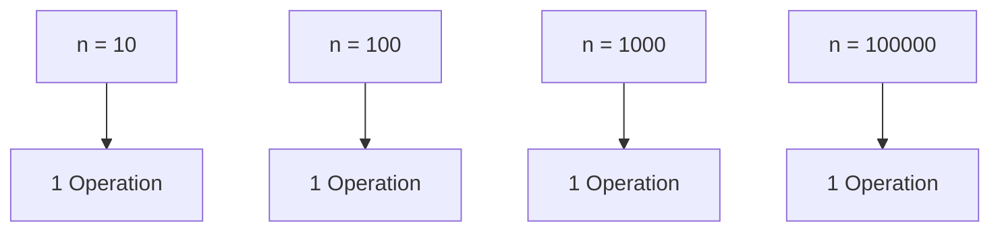
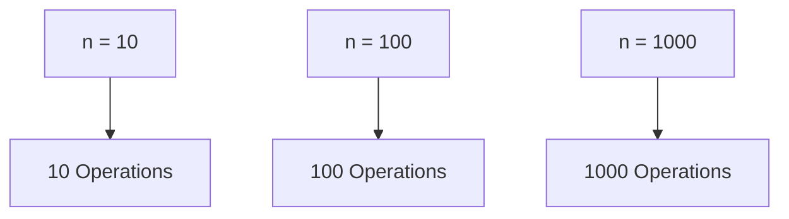
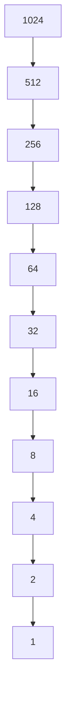
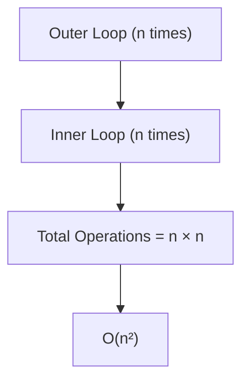
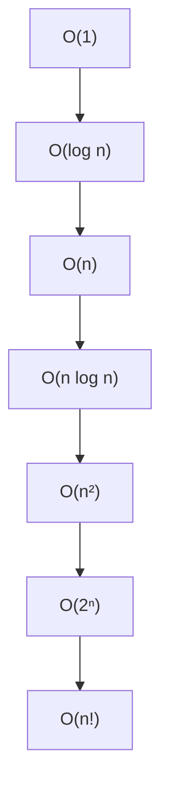
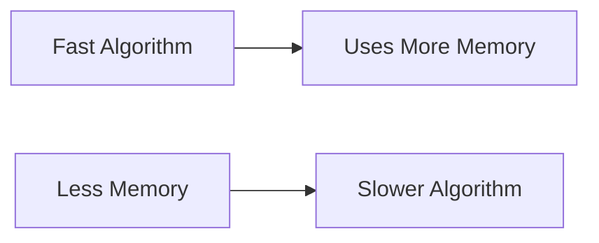
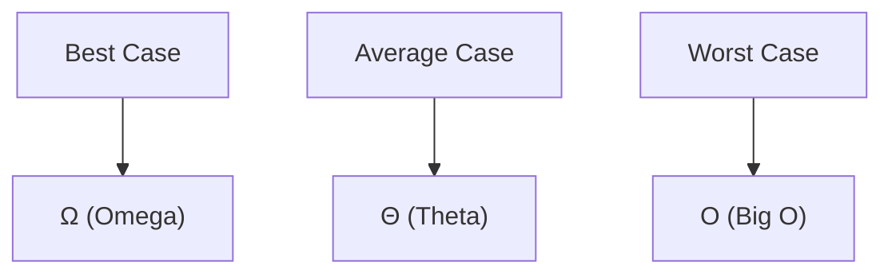

# 01 - Complexity Analysis

## Why Do We Need Complexity Analysis?

Imagine two students solving the same problem.

**Student A** solves it in **10 operations**.

**Student B** solves it in **10,000 operations**.

Both produce the correct answer.

But one solution is clearly more efficient.

Complexity Analysis helps us measure and compare the efficiency of algorithms.

It answers:

* How fast is an algorithm?
* How much memory does it use?
* Will it scale for large inputs?

---

## Real World Example

Suppose you want to find a book.

### Scenario 1

You have **10 books**.

Finding a book is easy.

### Scenario 2

You have **10,000 books**.

Finding a book now becomes much harder.

As data grows, the choice of algorithm becomes important.

Complexity Analysis studies how algorithms behave as input size increases.

---

## What is Input Size?

Input Size is represented using:

```text
n
```

### Examples

```text
Array of 100 elements
n = 100

Array of 1000 elements
n = 1000
```

Most complexity calculations are written in terms of **n**.

---

## What is Time Complexity?

Time Complexity measures how the number of operations grows as the input size grows.

### Important

Time Complexity does **NOT** measure:

* Seconds
* Milliseconds
* Actual execution time

It measures:

```text
Growth Rate
```

---

## Example 1: O(1)

```cpp
int firstElement = numbers[0];
```

No matter if:

```text
n = 10
n = 100
n = 1000000
```

only one operation is performed.

### Complexity

```text
O(1)
```

### Illustration



---

## Example 2: O(n)

```cpp
for (int index = 0; index < n; index++) {
    cout << index;
}
```

### Operations

```text
n
```

### Complexity

```text
O(n)
```

### Illustration



---

## Example 3: O(log n)

Binary Search repeatedly divides the search space in half.



### Complexity

```text
O(log n)
```

---

## Example 4: O(n²)

```cpp
for (int i = 0; i < n; i++) {

    for (int j = 0; j < n; j++) {

    }
}
```

### Operations

```text
n × n
```

### Complexity

```text
O(n²)
```

### Illustration



---

## Common Time Complexities

| Complexity | Name         |
| ---------- | ------------ |
| O(1)       | Constant     |
| O(log n)   | Logarithmic  |
| O(n)       | Linear       |
| O(n log n) | Linearithmic |
| O(n²)      | Quadratic    |
| O(2ⁿ)      | Exponential  |
| O(n!)      | Factorial    |

---

## Complexity Growth Ladder



---

## What is Space Complexity?

Space Complexity measures the extra memory used by an algorithm.

### Example

```cpp
int sum = 0;
```

Extra Memory:

```text
1 Variable
```

Complexity:

```text
O(1)
```

### Example

```cpp
vector<int> numbers(n);
```

Extra Memory:

```text
n Elements
```

Complexity:

```text
O(n)
```

---

## Time vs Space Tradeoff

Sometimes faster algorithms require more memory.



---

## Asymptotic Notations

Asymptotic Notations describe algorithm growth.

### Big O

Measures:

```text
Worst Case
```

### Omega (Ω)

Measures:

```text
Best Case
```

### Theta (Θ)

Measures:

```text
Average Case / Tight Bound
```

### Illustration


