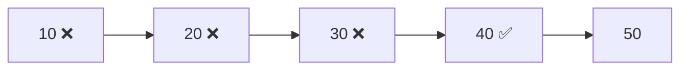
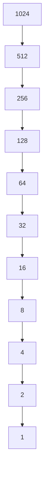

# 02 - Searching

## Why Do We Need Searching?

Imagine you're looking for a contact in your phone.

Do you manually check every contact?

Or do you use the search bar?

Searching is one of the most fundamental operations in Computer Science.

Almost every application uses searching:

* Google searches billions of web pages.
* Instagram searches usernames.
* Amazon searches products.
* WhatsApp searches contacts and chats.

Without efficient searching, software would become extremely slow as data grows.

---

## What is Searching?

Searching is the process of finding a specific element inside a collection of data.

Given:

```text
[10, 20, 30, 40, 50]
```

Find:

```text
40
```

Searching algorithms help determine:

* Whether the element exists.
* Where it exists.
* How quickly it can be found.

---

# Types of Searching

In this chapter we'll learn:

1. Linear Search
2. Binary Search
3. Lower Bound
4. Upper Bound

---

# Linear Search

## Real World Example

Imagine looking for a book in an unsorted pile.

You check:

```text
Book 1
Book 2
Book 3
Book 4
...
```

until you find the required book.

This is exactly how Linear Search works.

---

## How Linear Search Works

Target:

```text
40
```

Array:

```text
10 20 30 40 50
```

### Visualization



The algorithm checks each element one by one.

---

## Complexity

| Case         | Time Complexity |
| ------------ | --------------- |
| Best Case    | O(1)            |
| Average Case | O(n)            |
| Worst Case   | O(n)            |

Space Complexity:

```text
O(1)
```

---

## When To Use Linear Search?

Use Linear Search when:

* Data is small.
* Array is unsorted.
* Simplicity is preferred.

---

# Binary Search

## Real World Example

Imagine searching for a word in a dictionary.

You don't start from page 1.

Instead:

```text
Open Middle Page
↓
Check Word
↓
Discard Half
↓
Repeat
```

This is Binary Search.

---

## Requirement

Binary Search only works on:

```text
Sorted Data
```

---

## How Binary Search Works

Target:

```text
60
```

Array:

```text
10 20 30 40 50 60 70
```

### Step 1

```text
10 20 30 40 50 60 70
         ↑
        Mid
```

Since:

```text
60 > 40
```

Discard left half.

---

### Step 2

```text
50 60 70
   ↑
  Mid
```

Target Found.

---

### Visualization



Every step cuts the search space in half.

---

## Complexity

| Case         | Time Complexity |
| ------------ | --------------- |
| Best Case    | O(1)            |
| Average Case | O(log n)        |
| Worst Case   | O(log n)        |

Space Complexity:

```text
O(1)
```

---

## Why Binary Search Is Powerful

For:

```text
1,000,000 elements
```

Linear Search may check:

```text
1,000,000 elements
```

Binary Search checks only around:

```text
20 elements
```

This is why Binary Search is one of the most important algorithms in DSA.

---

# Lower Bound

## What is Lower Bound?

Lower Bound returns:

```text
First Position
Where Target Can Be Inserted
Without Breaking Sorting
```

---

## Example

Array:

```text
10 20 20 30 40
```

Target:

```text
20
```

Result:

```text
Index 1
```

Because index 1 contains the first occurrence of 20.

---

### Visualization

```text
Index:  0  1  2  3  4

Array: 10 20 20 30 40
             ↑
         First 20
```

---

## Complexity

```text
O(log n)
```

---

# Upper Bound

## What is Upper Bound?

Upper Bound returns:

```text
First Element
Strictly Greater Than Target
```

---

## Example

Array:

```text
10 20 20 30 40
```

Target:

```text
20
```

Result:

```text
Index 3
```

because:

```text
30 > 20
```

and it is the first such element.

---

### Visualization

```text
Index:  0  1  2  3  4

Array: 10 20 20 30 40
                   ↑
           First Greater
```

---

## Complexity

```text
O(log n)
```

---

# Comparison

| Feature                  | Linear Search | Binary Search |
| ------------------------ | ------------- | ------------- |
| Data Must Be Sorted      | ❌ No          | ✅ Yes         |
| Time Complexity          | O(n)          | O(log n)      |
| Easy To Implement        | ✅ Yes         | ✅ Yes         |
| Efficient For Large Data | ❌ No          | ✅ Yes         |

---

# Searching Complexity Cheat Sheet

| Algorithm     | Time Complexity | Space Complexity |
| ------------- | --------------- | ---------------- |
| Linear Search | O(n)            | O(1)             |
| Binary Search | O(log n)        | O(1)             |
| Lower Bound   | O(log n)        | O(1)             |
| Upper Bound   | O(log n)        | O(1)             |

---

# Interview Tips

Whenever you see:

```text
Sorted Array
```

ask yourself:

```text
Can Binary Search Be Used?
```

Many interview questions hide Binary Search behind different wording.

Common clues:

* Sorted Array
* Sorted Matrix
* Search Space
* Minimize Maximum
* Maximize Minimum
* First Occurrence
* Last Occurrence

These often indicate Binary Search.

---

# Common Beginner Mistakes

## Mistake 1

Using Binary Search on an unsorted array.

```text
Binary Search Requires Sorted Data
```

---

## Mistake 2

Incorrect middle calculation.

Avoid:

```cpp
int middle = (left + right) / 2;
```

Prefer:

```cpp
int middle = left + (right - left) / 2;
```

to avoid overflow.

---

## Mistake 3

Confusing Lower Bound and Upper Bound.

Remember:

```text
Lower Bound
=
First Position >= Target

Upper Bound
=
First Position > Target
```

---

# Key Takeaways

* Searching is used to locate elements in data.
* Linear Search checks elements one by one.
* Binary Search repeatedly halves the search space.
* Binary Search requires sorted data.
* Lower Bound finds the first position ≥ target.
* Upper Bound finds the first position > target.
* Binary Search is significantly faster than Linear Search for large datasets.
* Searching forms the foundation for many advanced DSA problems.

---

## Next Topic

➡️ 03 - Sorting

We'll learn how data can be arranged efficiently using algorithms such as Bubble Sort, Selection Sort, Insertion Sort, Merge Sort, Quick Sort, and Heap Sort.
